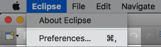
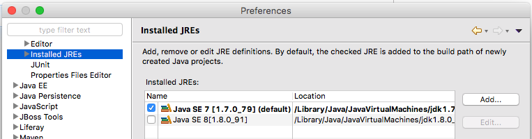
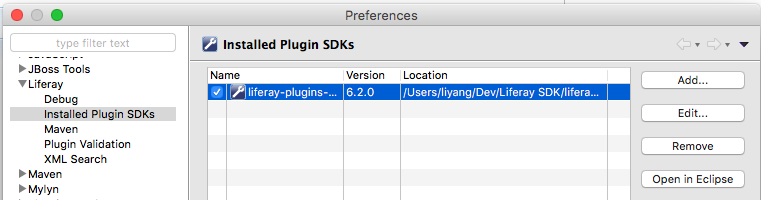
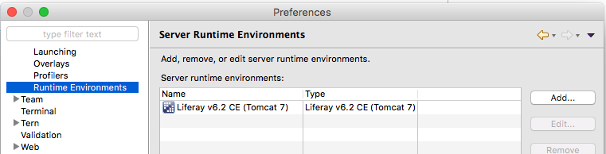
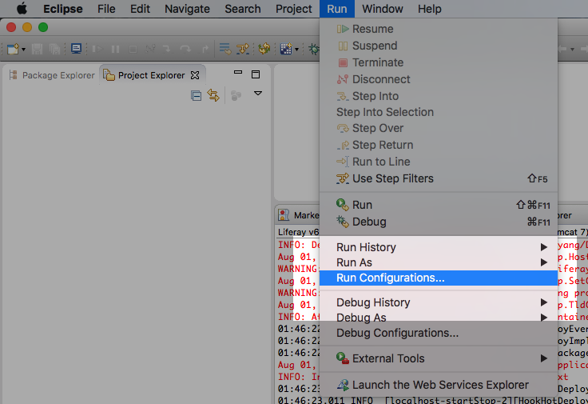
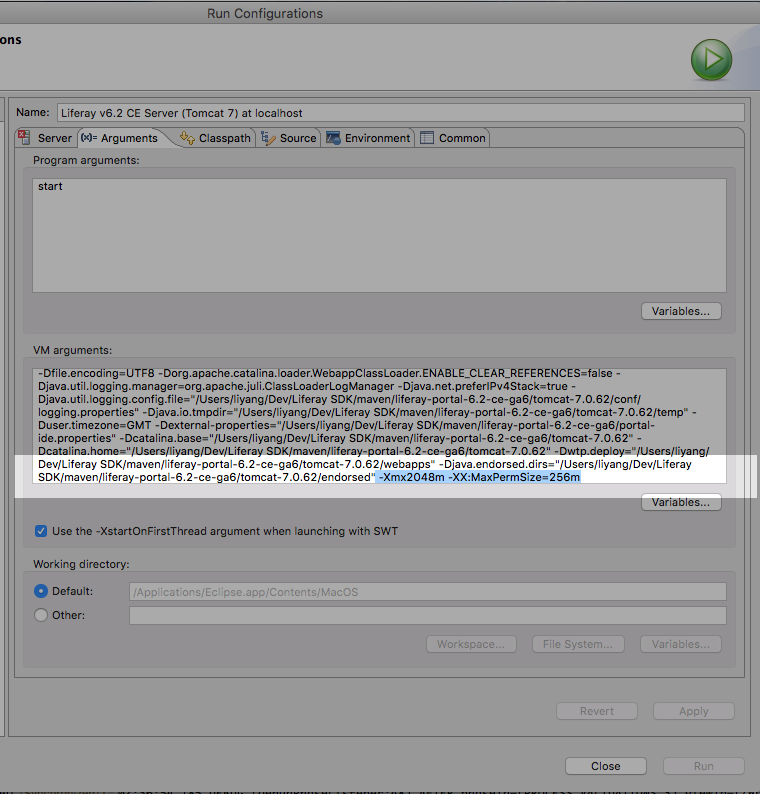

# Liferay quick Start
Installation Liferay and setup the environment 


## Overview
- [Homebrew](#homebrew) 
- [Git](#git)
- [Liferay](#liferay)  
	- [MySQL](#mysql)  
	- [Ant](#ant)  
	- [Maven](#maven)
	- [Debug](#debug)  

## Homebrew 
### install homebrew 
Run this line in your terminal will install [homebrew](http://brew.sh/) 

	/usr/bin/ruby -e "$(curl -fsSL https://raw.githubusercontent.com/Homebrew/install/master/install)"

### Homebrew usage  
In brew command you can search to check what you want to install application name.  
If homebrew have the application. You can use brew install to install it.

	brew search <your application>        # search the application name 
	brew install <your application>		  # install the application 

	# most of gui application install by brew cask
	brew cask search <your application>   
	brew cask install <your application>   

## Git
### install Git
In the macOS is already install git. 
If you want to install the new version of git following this command 
```bash 
brew install git
```


## Liferay
#### Download Liferay and Liferay Portal
[Liferay Portal 6.2.5 GA6](https://sourceforge.net/projects/lportal/files/Liferay%20Portal/6.2.5%20GA6/)  
[Liferay IDE](https://sourceforge.net/projects/lportal/files/Liferay%20IDE/)   

	# Download and expand to your workspace 
	liferay-ide-eclipse-macosx-x64-2.2.4-ga5
	liferay-plugins-sdk-6.2-ce-ga6
	liferay-portal-tomcat-6.2-ce-ga6
	liferay-portal-maven-6.2-ce-ga6

	# Just download 
	liferay-portal-doc-6.2-ce-ga6
	liferay-portal-src-6.2-ce-ga6
 

[JDK 7](http://www.oracle.com/technetwork/java/javase/downloads/jdk7-downloads-1880260.html)  

	# Download and install 
	jdk-7u79-macosx-x64.dmg


#### Eclipse 
Open eclipse in the path eclipse/eclipse  
Let start setup eclipse and open preferences config the IDE 

##### Setup Eclipse


1\. Check jre already install preferences > installed JREs  

  

2\. Add liferay plugin sdk, link the path to *liferay-plugins-sdk-6.2* folder 

  

3\. Setup runtime environment  
>	a. Choose **Liferay v6.2(Tomcat 7)**  
>	b. Same as step 2, link the path to **liferay-portal-6.2-ce-ga6/tomcat-7.0.62/**  
>	c. Link Javadock to **liferay-portal-src-6.2.zip**, link Source to **liferay-portal-src-6.2-ce-ga6.zip**  
>	d. Finish  


#### Start a project 

file > new > Liferay Plugin Project , and enter the name, click finish.
Possibly error when build. and you will see this error message.

	BUILD FAILED

	.
	.
	.......  HTTP Authorization failure
	

**solve step** [link](https://web.liferay.com/community/forums/-/message_boards/message/74382032)  
This is a problem about in the liferay-plugins-sdk-6.2/**build.properties** 

	# liferay-plugins-sdk-6.2/build.properties 
	# change line 341 
	ivy.jar.url=http://cdn.repository.liferay.com/nexus/content/repositories/liferay-snapshots-ce/com/liferay/org.apache.ivy/${ivy.version}/org.apache.ivy-${ivy.version}.jar
	# to 
	ivy.jar.url=https://repository.liferay.com/nexus/content/repositories/liferay-public-snapshots/com/liferay/org.apache.ivy/${ivy.version}/org.apache.ivy-${ivy.version}.jar

And satart a new project will be ok.  

## MySQL 
Use homebrew install MySQL and MySQLWorkbench  

	brew install mysql 
	brew cask install mysqlworkbench

### Usage 

	mysql.server status    # check mysql server status 
	mysql.server start     # start server 

enter mysql console 
	
	mysql -u root -p       # and enter will enter the mysql console 


## Ant
Use homebrew install Ant 
	
	brew install ant


## Maven  
Use homebrew install maven 

	brew install maven 


## Debug

### java.lang.OutOfMemoryError: PermGen space
if you get this error in liferay probably java runtime memory is too small  
in the Eclipse you can config it.  



config the arguments  

	-Xmx2048m
	-XX:MaxPermSize=256m



if you are a deploy version config it in tomcat/bin/setenv.sh (in windows is setenv.bat)

